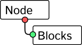

[NodeEditor](https://github.com/yDewolf/NodeEditor/) • [Nodeblocks::Server](https://github.com/yDewolf/node-editor-server-api) • [Documentação](https://github.com/yDewolf/NodeEditor/blob/server-docs/docs/server-docs.md) • [TODOs](TODO.md)

# Nodeblocks
Nodeblocks é um framework de sistemas baseados em nodes voltado para edição e em tempo real.

## Aviso:
Esse projeto está em constante desenvolvimento e está atualmente em estado de **beta**, ou seja, não há garantia alguma de que novas versões serão compatíveis com ``NodeScenes`` e ``TypeData`` de formatos anteriores.

## Esse repositório:


Esse repositório é voltado para o Editor de Nodes. O backend pode ser encontrado [aqui](https://github.com/yDewolf/node-editor-server-api).
> O Editor de Nodes é basicamente um frontend para acessar e modificar NodeScenes em um servidor que interpreta essas cenas. O client não precisa saber o que o servidor está fazendo em cada node, ele apenas altera o estado da cena do servidor. [sobre o client](https://github.com/yDewolf/NodeEditor/blob/server-docs/docs/layers/client.md).

## Como Desenvolver:
Instale o [node.js](https://nodejs.org/en/download), junto com algum gerenciador de versões.

````
// Usando npm:
npm install
npm run dev
````

## Como Rodar:

````
// Usando npm:
npm install
npm run build
npm start
````
